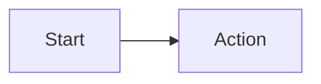

# 图片转 Mermaid 提示词约束

对每张抽取出的医学指南图片使用 VLM 时，使用本文件作为约束。

## VLM 指令

```text
请把这张医学指南图片转换为 Mermaid。

规则：
1. 只使用图片中可见的文字和可见结构。
2. 尽量保留原图中的英文术语、阈值、符号、脚注标记和药物名称。
3. 不要添加图片中没有出现的医学解释、翻译、建议或推荐意见。
4. 只输出一段 Mermaid 源码，不要输出 Markdown 代码围栏。
5. 垂直决策树、算法图和风险分层优先使用 flowchart TB；左右路径图优先使用 flowchart LR。
6. 节点内换行和项目列表使用 <br/>。
7. 标签中的比较符号按需要转义为 &lt; 和 &gt;。
8. 如果局部文字无法辨认，只在该片段标记 [unreadable]，不要猜测。
```

## 节点写法约定

- 长文本放在带引号的节点标签中，例如：`A["..."]`。
- 如果原图有明确的是/否分支或阈值判断，使用决策节点，例如：`A{"Serum albumin &lt;25 g/l"}`。
- 分支标签使用 Mermaid 的 pipe 语法，例如：`A -->|Yes| B`。
- 看起来重复的图片在不同位置出现时，尽量保持 Mermaid 写法一致。

## 输出形态

`mermaid_map.json` 中推荐这样写：

```json
{
  "image_001": "flowchart LR
    A["Start"] --> B["Action"]"
}
```

不要把 Markdown 代码围栏存进 JSON 值。回填脚本会自动生成下面这种 Mermaid 代码块：

~~~markdown

~~~
