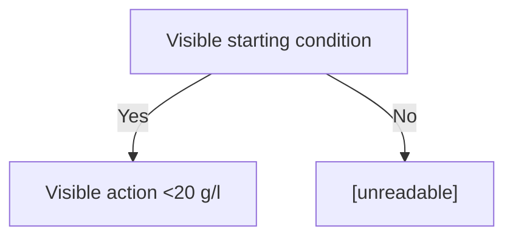
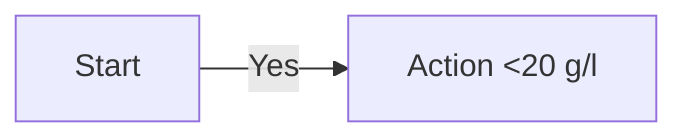

# 图片转 Mermaid 提示词约束

对每张抽取出的医学指南图片使用 VLM 时，使用本文件作为约束。目标不是“看起来像 Mermaid”，而是生成能被常见 Mermaid 渲染器稳定解析的 flowchart。

## VLM 指令

```text
请把这张医学指南图片转换为可渲染的 Mermaid flowchart。

必须遵守：
1. 只输出 Mermaid 源码，不要输出 Markdown 代码围栏。
2. 第一行只能是 flowchart TB 或 flowchart LR。
3. 节点 id 只能使用 ASCII 字母、数字和下划线，例如 A、B、N01、Decision_1；id 里不要有空格、连字符、中文、单位或标点。
4. 每个节点必须写成 ID["label"] 或判断节点 ID{"label"}，长文本也要放进带引号的 label。
5. 节点内换行使用 <br/>。
6. label 中的 < 和 > 必须写成 &lt; 和 &gt;，例如 &lt;20 g/l；不要直接写 <20 g/l。
7. 带文字的边必须写成 A -->|Yes| B；不要写 A --|Yes| B，也不要让边指向没有 id 的 [unreadable]。
8. 无法识别的内容写成一个正常节点，例如 U01["[unreadable]"]，再连到这个节点。
9. 不要使用 classDef、class、style、click、subgraph 或 HTML 标签；唯一允许的 HTML 片段是 <br/>。
10. 保留图片中可见的英文术语、阈值、符号、脚注标记和药物名称；不要添加图片中没有出现的医学解释、翻译、建议或推荐意见。
```

## 推荐模板



## 常见错误

不要这样写：

```text
A[Serum albumin <20 g/l]          # < 没有转义
A --|Yes| B                       # 边标签语法错误
A -- High risk --> [unreadable]   # 目标节点没有 id
A:::blue                          # 样式语法容易造成渲染兼容问题
subgraph Phase                    # 本 skill 为了稳定渲染禁用 subgraph
```

应该改成：

```text
A["Serum albumin &lt;20 g/l"]
A -->|Yes| B
A -->|High risk| U01["[unreadable]"]
```

## `mermaid_map.json` 写法

JSON 值里不要写 Markdown 代码围栏，只写 Mermaid 源码，并用 `\n` 表示换行：

```json
{
  "image_001": "flowchart LR\n    A[\"Start\"] -->|Yes| B[\"Action &lt;20 g/l\"]"
}
```

回填脚本会自动生成：

~~~markdown

~~~
